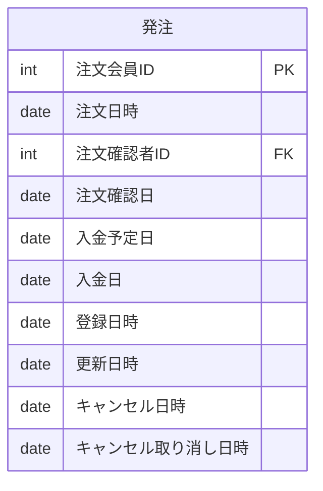
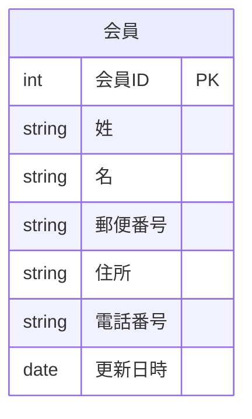
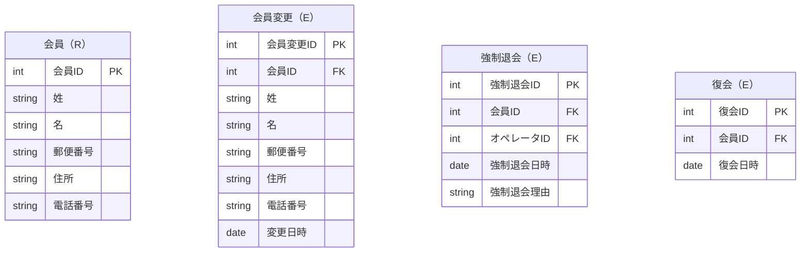

# 概要

- イミュータブルデータモデルについて学ぶ
- [参考ページ](https://scrapbox.io/kawasima/%E3%82%A4%E3%83%9F%E3%83%A5%E3%83%BC%E3%82%BF%E3%83%96%E3%83%AB%E3%83%87%E3%83%BC%E3%82%BF%E3%83%A2%E3%83%87%E3%83%AB)

## イミュータブルデータモデルが必要となる背景

- 更新には複雑なルールが伴うから、CRUDの中でUPDATEが最もシステムを複雑化する
- システム設計において複雑さを抑制するためには更新を減らすことが肝要
- イミュータブルデータモデルを用いることで更新を抑制することができる

## 手順

1. エンティティを抽出する
2. エンティティを分類する
3. イベントエンティティには1つの日時属性しか持たないようにする
4. リソースに隠されたイベントを抽出する
5. 非依存リレーションシップを交差エンティティにする

### 1. エンティティを抽出する

- エンティティの候補は、5W1Hを見つけること

>ex. 要求文書
発注担当者が受注リストを元に、商品の在庫を確認し、在庫があれば商品を注文者の注文時の送付先住所に発送する

これを5W1Hに分解すると
- Who ... 発注担当者、注文者
- What ... 受注リスト、商品、在庫、発送
- When
- Where ... 送付先住所
- Why
- How

抽出したエンティティを扱う用語辞書を作る

|種別|和名|英名|
|----|----|----|
|Who|発注担当者|hoge|
|Who|注文者|Purchaser|
|What|受注リスト|OrderList|
|What|商品|Product|
|What|在庫|Stock|
|How|発送|Shipping|
|Where|送付先住所|Shipping Address|

#### エンティティの３大要素
1. 単一性 ... 何が一つのものであるか
2. 同一性 ... 2つのものが同じであると、どういう時に言えるのか
3. カテゴリ ... それは何であるか、どんな分類で識別されるか

ex. 情報コンテンツサイトにおける記事エンティティは以下のような点を決める必要がある

1. 単一性 ... 全7回ものの記事は、同じ1つの記事として扱う？それとも別々？
2. 同一性 ... 記事の内容はどんなに書き換えられても同じものとして扱う？どこまで書き換えられたら別の記事として扱う？
3. カテゴリ ... 記事の範囲はクライアント入稿記事だけを指す？それともライターに依頼した記事も含む？FAQみたいなものはそこに入る？

### 2. エンティティを分類する

- 抽出したエンティティを「リソース」と「イベント」に分類する
- 基準は、明確に属性に「日時」を持つか否か
- もしくは、「〜する」と言えるかどうか
- 5W1Hで言えば、「Why、How」はイベント「その他」はリソースとなる

ex. 
- 会員 ... 日時なし -> 会員する「X」
- 注文 ... 日時あり「注文日時」 -> 注文する「O」

|種別|和名|英名|分類|
|----|----|----|----|
|Who|発注担当者|hoge|リソース|
|Who|注文者|Purchaser|リソース|
|What|受注リスト|OrderList|リソース|
|What|商品|Product|リソース|
|What|在庫|Stock|リソース|
|How|発送|Shipping|イベント|
|Where|送付先住所|Shipping Address|リソース|

### 3. イベントエンティティには1つの日時属性しか持たないようにする

例えば、複数の日時属性を持つテーブル「発注」があったならば、分解しそれぞれのエンティティを作る

なお、「請求予定日」のような将来の予定を表すものや「有効期限」「適用開始日」のようにデータのライフサイクルを表すものはここでいう「日時属性」には当たらない
ex. 消費税

複数の日時属性を持つ＝エンティティに対する更新があるということ
更新がある＝イベントがある

故にそれぞれをイベントエンティティとして抽出することができる
これは正規化の原則である「One fact in one place」を自然と実現することにつながる

#### イベントが一つの日時では捉えきれない場合

業務上認識するイベントが「始まり」と「終わり」がありそれぞれ日時が異なるケースが多々ある

この時も、原則イベントエンティティには1つの日時属性しか持たせないようにするが、
元の大きなまとまりでのイベントがどういう状態かを見たいケースがありその際に使えるのが
「ロングタームイベントパターン」

// TODO: 実装する

### 4. リソースに隠されたイベントを抽出する

- リソースエンティティに更新日時を持たせたいといった場合には、それにまつわるイベントエンティティの抽出漏れが考えられる

ex.
- 会員が自分自身で会員情報変更ページから変更
- 規約に違反した会員であったため、管理者が強制退会する
- 会員から誤った操作をしてしまったため復元を依頼され、管理者が復元する

### 5. 非依存リレーションシップを交差エンティティにする

## サンプルアプリケーション構築

- [sqlite x prismaサンプル](https://www.prisma.io/docs/getting-started/quickstart-sqlite)

## 所感
