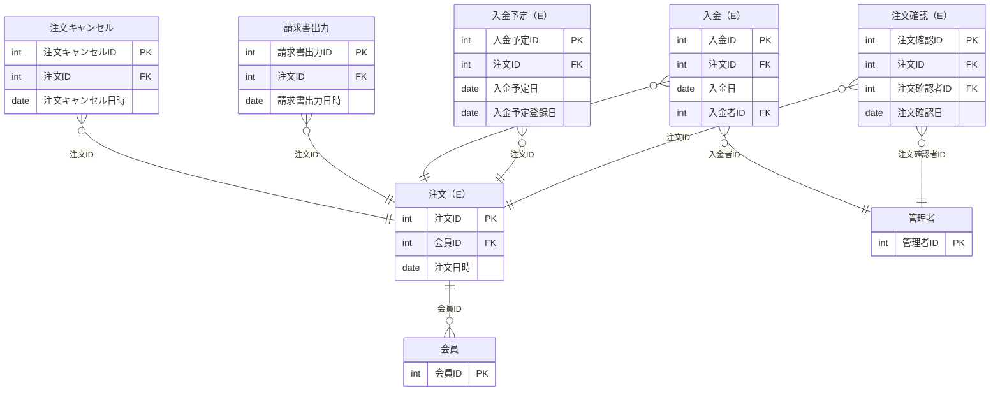

# 概要

- イミュータブルデータモデルによるデータモデリングを行う
- 要求を元に、モデリングをし、最終的には実装に落とし込む

## 要求

- 発注担当者が受注リストを元に、商品の在庫を確認し、在庫があれば商品を注文者の注文時の送付先住所に発送する

## モデル

| 種別 | 和名           | 英名               | 分類     |
| ---- | -------------- | ------------------ | -------- |
| When | 注文           | Order              | イベント |
| Who  | 会員           | Member             | リソース |
| When | 注文確認       | Order Confirmation | イベント |
| Who  | 管理者         | Administrator      | リソース |
| When | 入金予定       | Scheduled Payment  | イベント |
| When | 入金           | Payment            | イベント |
| When | 請求書出力     | Invoice Issuance   | イベント |
| When | 注文キャンセル | Order Cancellation | イベント |

