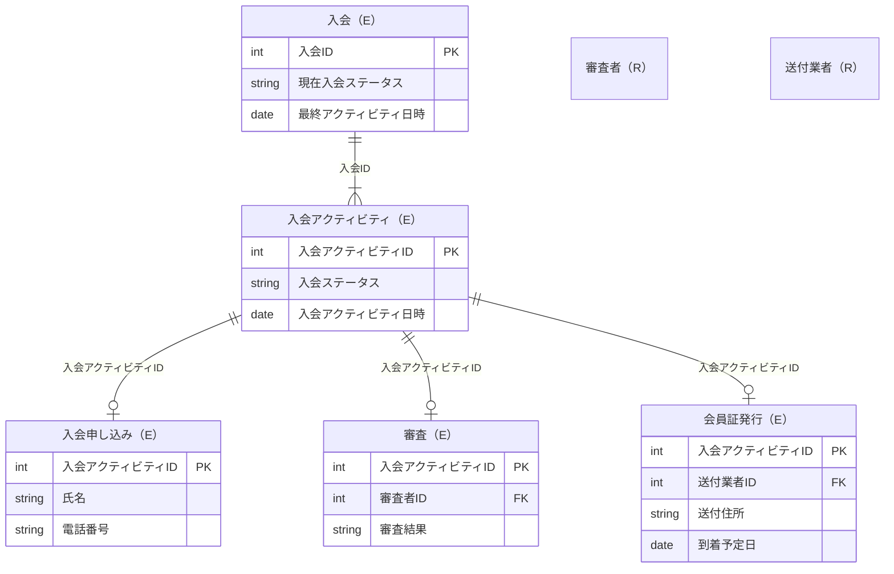

# 概要

- ロングタームイベントパターンを実装する

## ロングタームイベントパターン

> 業務上認識するイベントが、始まりと終わりがあってそれぞれ日時が異なるケースが多々ある。このときも基本的な原則は「イベントエンティティには1つの日時属性しかもたないようにする」である。
> 
> といっても、元の大きな意味でのイベントがどういう状態かを見たいケースがあるので、これを表すエンティティも欲しい。ということで、次に示す[[ロングタームイベントパターン]]が適用できる。

## ER図

※ sqlite利用に伴い、面倒なのでidはintで

## モデル概要

### 入会（E）
- 入会アクティビティ（E）が作成されると更新される

### 入会アクティビティ（E）
- アクティビティのスーパータイプ（INSERT Only）

## 解説
> 「入会」という長い期間でのイベントに対し、その中で発生する詳細イベント(入会申し込み、審査、会員証発行)はそれぞれエンティティとして表す。詳細イベントは共通して日時属性を持つので、スーパータイプとして入会アクティビティを持つ。
> こうすると、「入会申し込み」の業務では、入会、入会アクティビティ、入会申し込みにそれぞれデータがINSERTされ入会エンティティの現在入会ステータスは「入会申し込み」になる。続く「審査」の業務では、入会アクティビティ、審査にデータがINSERTされ、入会の現在入会ステータスが「審査」に更新される。こうして詳細イベントはただ1つの日時属性をもつエンティティでINSERT ONLYなデータライフサイクルが実現され、更新が発生するのはロングタームイベントの「入会」のみになる。